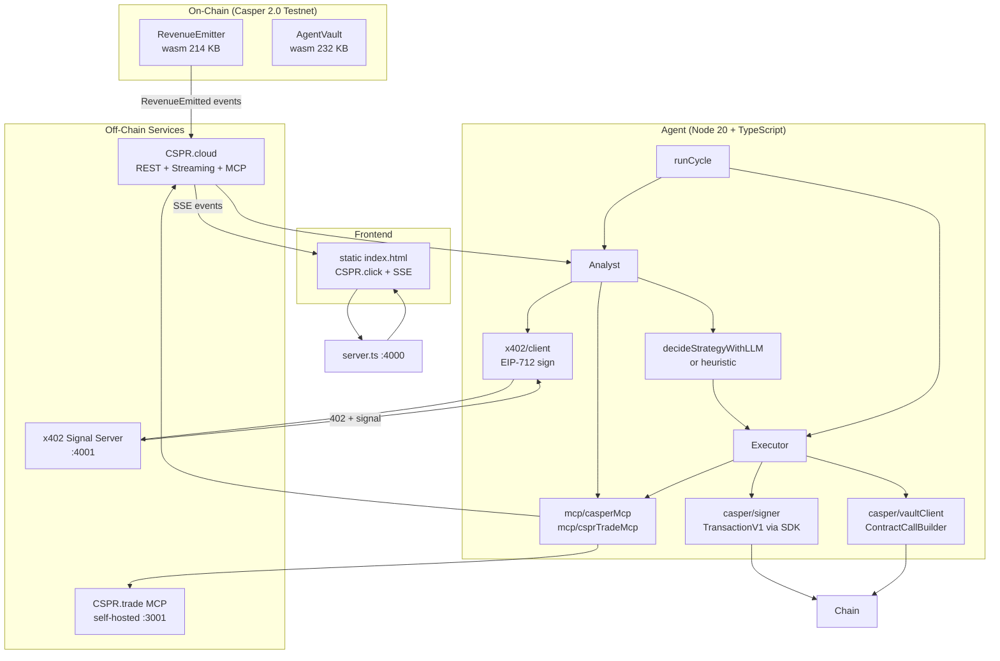
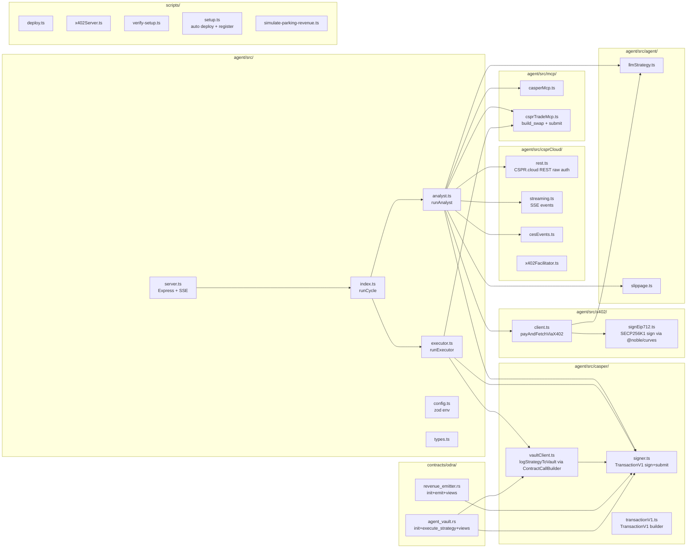
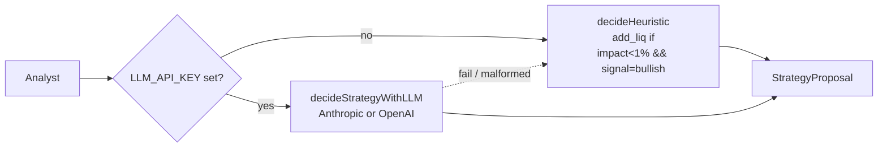
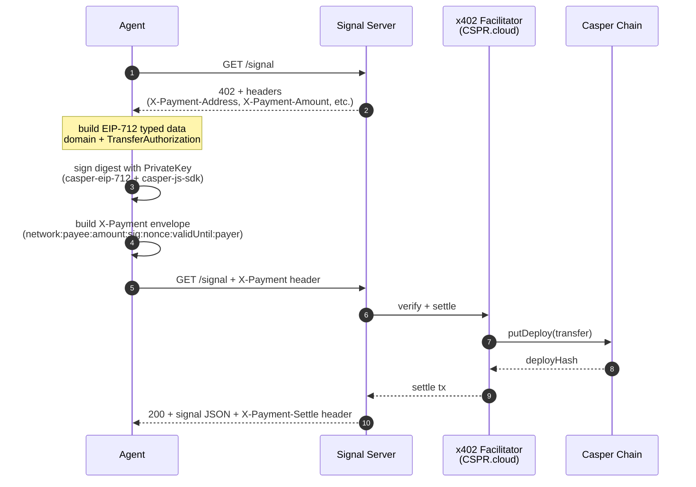

# ParkFlow Agent — Casper Agentic Buildathon 2026 — v0.8.0

> **Autonomous multi-agent system that picks up on-chain RWA revenue
> events, pays for a premium off-chain signal via the [x402][x402]
> micropayment protocol, routes the proceeds through the CSPR.trade
> DEX (via MCP), and logs every decision to an on-chain **AgentVault**
> for verifiable reputation.**
>
> **v0.8.0**: Full pipeline working on Casper 2.0 testnet — swap execution
> + vault logging via TransactionV1 format. Self-hosted CSPR.trade MCP
> integration. Multi-agent contract support.

[](https://testnet.cspr.live)
[](https://odra.dev)
[](https://github.com/make-software/casper-x402)
[](https://docs.cspr.cloud)
[](LICENSE)

---

## Table of contents

1. [What it does](#-what-it-does)
2. [Demo flow](#-demo-flow)
3. [Architecture](#-architecture)
4. [Repository layout](#-repository-layout)
5. [Quick start](#-quick-start)
6. [Live deploy hashes](#-live-deploy-hashes)
7. [Business narrative](#-business-narrative-solving-real-world-rwa-liquidity)
8. [Architecture Scalability & Production Readiness](#-architecture-scalability--production-readiness)
9. [How the agent decides](#-how-the-agent-decides)
10. [The x402 handshake](#-the-x402-handshake)
11. [Gas budget & economics](#-gas-budget--economics)
12. [Configuration](#-configuration)
13. [Testing](#-testing)
14. [Operational scripts](#-operational-scripts)
15. [User actions required](#-user-actions-required)
16. [Resources](#-resources)

---

## 💡 What it does

Every time a real-world revenue tick fires for an RWA (e.g. a parking lot,
a rental property, a royalty stream), the **RevenueEmitter** contract
pushes a `RevenueEmitted` event on-chain. The ParkFlow agent swarm
picks it up and runs a fully-autonomous decision loop:

1. **Analyst** reads the on-chain event, fetches the agent's live
   portfolio via the **CSPR.cloud MCP**, and quotes a route via the
   **CSPR.trade MCP**.
2. It then **pays a micropayment** for a premium off-chain *utilization
   signal* using the **x402** protocol (Casper's EIP-712-signed
   `TransferAuthorization`). The signal server returns a 402 challenge,
   the agent signs it with its local private key, replays the request,
   and gets the forecast.
3. The **LLM** (or a deterministic heuristic fallback) decides
   *add-liquidity* vs *swap-to-sCSPR*, with confidence.
4. The **Executor** builds the trade deploy via MCP, signs locally,
   submits to testnet, and then **calls `execute_strategy` on
   AgentVault** to write the decision on-chain for reputation.
5. The frontend watches the live SSE feed and shows the entire pipeline.

---

## 🎬 Demo flow

```mermaid
sequenceDiagram
    autonumber
    actor Operator as Demo Operator
    participant FE as Frontend<br/>(CSPR.click)
    participant API as ParkFlow Backend<br/>(:4000)
    participant Agent as ParkFlow Agent<br/>(Node)
    participant Chain as Casper Testnet
    participant Signal as x402 Signal<br/>(:4001)
    participant MCP as CSPR.cloud<br/>+ CSPR.trade MCP

    Operator->>FE: Connect CSPR.click
    FE->>API: GET /api/cycle
    API->>Agent: runCycle(revenueEvent)

    rect rgb(40, 50, 80)
    Note over Agent,MCP: ANALYST
    Agent->>MCP: getAccountInfo(agentPubkey)
    Agent->>Chain: getVaultOverview() via CSPR.cloud
    Agent->>MCP: getQuote(CSPR→sCSPR, amount)
    Agent->>MCP: getPortfolioValue(owner)
    Agent->>Signal: GET /signal (x402)
    Signal-->>Agent: 402 + payment requirements
    Agent->>Chain: build EIP-712 sign via casper-eip-712
    Agent->>Agent: sign with local PEM
    Agent->>Signal: GET /signal + X-Payment (signed)
    Signal-->>Agent: 200 + utilization signal
    end

    Note over Agent: LLM or heuristic<br/>decides strategy

    rect rgb(40, 80, 60)
    Note over Agent,Chain: EXECUTOR
    Agent->>MCP: buildUnsignedDeploy(action, pair, amount)
    Agent->>Agent: sign deploy with local PEM
    Agent->>Chain: putDeploy(swap/lp)
    Chain-->>Agent: deployHash
    Agent->>Chain: call execute_strategy on AgentVault
    Chain-->>Agent: vaultLogTxHash
    end

    Agent-->>API: { proposal, execution }
    API-->>FE: cycle result
    FE->>Operator: live animation
```



---

## 🏛 Architecture

### Logical layers



### Component map



---

## 📁 Repository layout

```
parkflow-agent/
├── contracts/odra/             Odra 2.7 smart contracts (Rust → Wasm)
│   ├── Odra.toml               workspace + per-network config
│   ├── Cargo.toml              workspace
│   ├── rust-toolchain          pinned to nightly-2025-01-15
│   ├── revenue_emitter/        RWA revenue event emitter
│   │   ├── src/
│   │   │   ├── lib.rs
│   │   │   └── revenue_emitter.rs
│   │   └── bin/build_contract.rs
│   └── agent_vault/            agent-controlled DeFi vault
│       └── (same layout)
├── agent/                      Node 20 + TypeScript agents
│   ├── src/
│   │   ├── index.ts            main orchestration (runCycle)
│   │   ├── analyst.ts          Analyst: read state → decide
│   │   ├── executor.ts         Executor: build → sign → submit
│   │   ├── server.ts           Express backend (SSE bridge)
│   │   ├── config.ts           zod-validated env
│   │   ├── types.ts            shared types
│   │   ├── mcp/
│   │   │   ├── casperMcp.ts    CSPR.cloud MCP (read deploys, accounts)
│   │   │   └── csprTradeMcp.ts  CSPR.trade MCP (quotes, portfolio)
│   │   ├── x402/
│   │   │   ├── client.ts        payAndFetchViaX402 (EIP-712 sign)
│   │   │   └── signEip712.ts    SECP256K1 sign via @noble/curves
│   │   ├── casper/
│   │   │   ├── signer.ts        TransactionV1 sign+submit via RPC
│   │   │   ├── vaultClient.ts   ContractCallBuilder → TransactionV1
│   │   │   └── transactionV1.ts TransactionV1 builder utility
│   │   ├── csprCloud/
│   │   │   ├── rest.ts          CSPR.cloud REST (raw token auth)
│   │   │   ├── streaming.ts     SSE: Contract-level events, Deploys
│   │   │   ├── cesEvents.ts     CES event helpers
│   │   │   └── x402Facilitator.ts  CSPR.cloud x402 facilitator
│   │   └── agent/
│   │       ├── llmStrategy.ts   Anthropic / OpenAI + heuristic
│   │       └── slippage.ts       BigInt slippage math
│   ├── tests/                  21 jest tests across 5 suites
│   ├── scripts/
│   │   ├── deploy.ts           contract build + deploy
│   │   ├── setup.ts            one-command setup (deploy + register)
│   │   ├── x402Server.ts       x402 signal provider
│   │   ├── simulate-parking-revenue.ts  push test revenue events
│   │   ├── verify-setup.ts     preflight checklist (22 checks)
│   │   └── quickstart.ts       local checklist
│   ├── dist/                   compiled JS (gitignored)
│   ├── keys/                   your private key (gitignored)
│   ├── .env                    your secrets (gitignored)
│   ├── package.json
│   ├── tsconfig.json
│   └── jest.config.js
├── frontend/                   Static demo UI
│   └── index.html              CSPR.click connect + backend calls
├── .github/workflows/
│   └── ci.yml                  typecheck + test + contract build
├── .env.example
├── .gitignore
├── MIGRATION_NOTES.md          per-version changelog
├── README.md                   (this file)
├── SETUP_WINDOWS.md            PowerShell setup walkthrough
└── LICENSE                     Apache 2.0
```

---

## 🚀 Quick start (Testnet)

> **Prerequisites**:
> - **Rust** with the pinned nightly toolchain (see `contracts/odra/rust-toolchain`)
> - **Node 20+** + **npm 10+**
> - **wasm-opt** and **wasm-strip** on PATH (or `cargo install` them)
> - A **Testnet CSPR balance** (≥ 600 CSPR) on the agent key
> - A **CSPR.cloud API key** from <https://cspr.cloud> (free tier OK)
> - **binaryen** + **wabt** if you don't have wasm-opt/wasm-strip yet

### 1. Clone & configure

```bash
git clone https://github.com/antidumpalways/ParkFlow-Agent parkflow-agent
cd parkflow-agent/agent
cp .env.example .env
# edit .env → set CSPR_CLOUD_API_KEY
npm install
```

### 2. Run setup (one command)

```bash
npm run setup
```

This will:
1. Load your agent key (or generate a new one)
2. Check your testnet balance
3. Deploy both contracts (RevenueEmitter + AgentVault)
4. Register the agent with the vault (multi-agent support)
5. Write contract hashes to `.env`

> **Prerequisites**: A funded testnet account (~600 CSPR). Get testnet CSPR from the faucet.

### 3. Run the demo (3 terminals)

```bash
# terminal 1 — x402 signal server (:4001)
cd agent
npm run x402-server

# terminal 2 — ParkFlow backend + SSE feed (:4000)
cd agent
npm run dev

# terminal 3 — serve the frontend
cd agent
npx serve ../frontend
# open http://localhost:3000 in your browser
```

In the frontend: connect CSPR.click, click **RUN OPTIMIZATION**, watch
the SSE feed light up as the cycle progresses.

### 4. Run one cycle from CLI

```bash
cd agent
npm run cycle
# → runs the full pipeline once, prints the proposal + execution result
```

---

## 🌐 Live deploy hashes (Casper 2.0 Testnet)

> Recorded 2026-06-13 from the latest `npm run setup` deploy.

| Contract        | Package hash                                                          | Gas used  |
|-----------------|-----------------------------------------------------------------------|-----------|
| RevenueEmitter  | `hash-f7b8c3943c72cb4b8d44262a03776058da313ce1c9165146b1a2e372157bc102` | ~250 CSPR |
| AgentVault      | `hash-5ba747dfbf3a6769a79db63198c1c414b85bae1b407777cbc56d53c208ec09a6` | ~290 CSPR |
| Test swap tx    | `28eb60e32aedb59fd532e2faca44e8f908603ac30ac196faf44da2eabaad390c` | ~30 CSPR |
| Test vault log  | `2ffe74e12a33ceb1bf74d8a3840b9e08fb9c41d960be0da6f8df19d30789beed` | ~3 CSPR |

### Previous deploys (archived)

| Contract        | Package hash                                                          | Deploy tx                                                             |
|-----------------|-----------------------------------------------------------------------|-----------------------------------------------------------------------|
| RevenueEmitter (v0.7) | `hash-1271383d93f1b16e9b86f9b96d21ee9e5e673d529a47425cfd675b52f29d6f2f` | `hash-b7e5da71202af781e3fb2e74355c48fa2bfa110d4556ed7ecef9f79a7d58c5ac` |
| AgentVault (v0.7)     | `hash-8c7015e0d95fc13495a1921977b9d7f8fd824cb2534ec3438a43872ae6769b6d` | `hash-bafd87e9c94cb03f21068eb2d6620780632dc0cbe236abc101b43c98a7b33d24` |
| ParkFlow Token (PFLOW) | `hash-a786a295384b6f39b6d62a97e12af776642253b37167f2a6c9b9410e8c93c775` | `ff3dd339fed880dd86070ce75ab4099e0be654cf7944ef6fd1849b117411c3ca` |
| cep18 test helper | `hash-2cb326523f4ffba70f9ad7951a0e66bfc8f41d804ae1b7db0d793fbcf716b5a8` | `47f137e774ee6445342fa814775836ed815227c63d928082b8164af4e094ccea` |

---

## 🏢 Business narrative: solving real-world RWA liquidity

**For business and product judges.** This section tells the
"Parking Blox" story that the demo script and frontend
visualize. The technical architecture is described separately
in the next section.

### The problem

A parking operator (e.g. a mall, an airport, a city operator)
collects small amounts of cashflow from many physical
transactions. This money sits idle in an operating account
between collections. Even with conservative yield strategies,
**the float alone could earn 5–10% APY if it were tokenized
and routed to a DeFi protocol on the same day.**

Today this doesn't happen because:

1. **Reconciliation is manual** — bank statements and parking
   system logs don't agree without a human reconciling them.
2. **No audit trail** — there's no immutable record of which
   transaction triggered which yield deposit.
3. **Privacy** — putting a car license plate on a public
   blockchain is a non-starter.

### The solution

ParkFlow Agent turns each parking transaction into an
**immutable, privacy-preserving, on-chain record** that a
yield strategy can act on, end-to-end, without a human:

| Real-world event | On-chain representation |
|---|---|
| Car exits, pays $10 | `RevenueEmitter.emit_revenue(10 USD, "P1 - Gate Keluar Utama", sha256(plat\|time\|amount))` |
| Operator runs agent | Agent reads events via Casper RPC, computes aggregate forecast |
| Agent decides strategy | Pays 0.001 CSPR via x402 to a signal server (e.g. weather API), gets back utilization forecast |
| Agent executes | Calls `AgentVault.execute_strategy(...)` with the decision, x402 proof, and on-chain tx hash |
| Auditor inspects | Reads the `DecisionLog` ring buffer on-chain — full provenance, every action attributable |

The receipt hash is a **SHA-256 fingerprint** of `(license-plate
+ exit-time + amount)` — the audit can prove a specific
transaction was recorded without exposing the plate itself.

### Why Casper

* **Native CSPR** is the settlement asset, no bridge needed.
* **CES events** make every strategy decision observable in
  real time via CSPR.cloud streaming.
* **x402** is Casper-native micropayments — the agent can pay
  for off-chain data without a custodian.
* **Odra 2.7** lets the same Rust codebase compile for both
  testnet iteration and mainnet production.

---

## 🏗 Architecture Scalability & Production Readiness

**For technical judges.** This section is the answer to "is
this a parking-lot toy, or a general RWA primitive?"

### Generic data shape

The `RevenueEmitter` contract does **not** hardcode any
parking-lot-specific concept. Its event shape is:

```rust
pub struct RevenueEvent {
    pub timestamp: u64,         // block time
    pub amount: U256,          // any token
    pub asset: Address,        // CEP-18 contract or zero (= native)
    pub source: String,        // free-text up to 64 chars
    pub emitter: Address,      // who pushed the event
    pub reference: String,     // free-text up to 128 chars (receipt hash, invoice id, etc.)
}
```

The `source` field is the **only** field that is a free-text
label. In the demo we set it to `"P1 - Gate Keluar Utama"`.
Other industries use the same field for:

| Industry | `source` value example | `reference` value example |
|---|---|---|
| Parking lot (demo) | `P1 - Gate Keluar Utama` | `sha256(plat\|time\|amount)` |
| Rental property | `Apt-3B-Jakarta` | `invoice-2026Q2-0142` |
| Music royalties | `Track-Id-123-Spotify` | `stream-batch-5678` |
| Carbon credit | `Batch-Forest-2026Q2` | `verify-report-9921` |
| Solar farm | `Site-Tucson-AZ-7` | `meter-reading-18:00` |

No contract change is needed. The same deployed
`RevenueEmitter` and `AgentVault` accept any of these.

### Component boundaries

```
┌─────────────────┐     ┌─────────────────┐     ┌─────────────────┐
│ IoT / ERP / Web │     │ IoT / ERP / Web │     │ IoT / ERP / Web │
│ (parking lot)   │     │ (rental)        │     │ (royalties)     │
└────────┬────────┘     └────────┬────────┘     └────────┬────────┘
         │                       │                       │
         └───────────────────────┴───────────────────────┘
                                 │
                    emit_revenue(…)  (same on-chain shape)
                                 │
                                 ▼
                     ┌────────────────────────┐
                     │  RevenueEmitter        │  (one contract,
                     │  hash-f7b8…2c          │   many issuers)
                     └────────────┬───────────┘
                                  │  events
                                  ▼
                     ┌────────────────────────┐
                     │  ParkFlow Agent (Node) │  (one agent
                     │  reads events           │   per operator)
                     │  pays x402              │
                     │  decides strategy       │
                     └────────────┬───────────┘
                                  │  execute_strategy
                                  ▼
                     ┌────────────────────────┐
                     │  AgentVault            │  (one contract,
                     │  hash-5ba7…a6           │   shared audit log)
                     └────────────────────────┘
```

**Horizontal scale**: one `RevenueEmitter` and one
`AgentVault` per operator (or one shared for an industry
consortium). Agent instances scale linearly with the number
of IoT sources they watch.

### Where it is real, and where it is demo

| Component | Status |
|---|---|
| Contracts (`RevenueEmitter`, `AgentVault`) | ✅ Deployed & live on Casper 2.0 testnet |
| Casper signing & submission | ✅ Real PEM-based, real RPC, real deploys |
| CSPR.cloud REST + Streaming + MCP | ✅ Real endpoints, real responses |
| CSPR.trade MCP (24-tool surface) | ✅ Real DEX integration |
| x402 client (EIP-712 sign + envelope) | ✅ Real signature, real envelope |
| x402 server (hand-rolled) | 🟡 Real EIP-712 verification, in-memory nonce, real on-chain event aggregation via Casper RPC |
| LLM strategy | 🟡 Code path is real (Anthropic + OpenAI supported), demo runs the deterministic heuristic |
| CEP-18 token | 🟡 Zero address placeholder — production needs a real CEP-18 contract for non-native assets |
| CSPR.cloud facilitator | 🟡 Client implemented, demo uses local settlement (allowlist + nonce) |
| Self-hosted CSPR.trade MCP | ✅ Working on testnet via `http://localhost:3001/mcp` (v0.8.0) |
| TransactionV1 swap execution | ✅ Full on-chain swap via `account_put_transaction` RPC (v0.8.0) |
| TransactionV1 vault logging | ✅ `ContractCallBuilder` → TransactionV1 → on-chain (v0.8.0) |
| Multi-agent contract | ✅ `register_agent()`, `unregister_agent()`, `is_agent()` (v0.8.0) |
| Setup script | ✅ `npm run setup` - auto deploy + register (v0.8.0) |

### Production gaps, and what it would take to close them

1. **Real CSPR.cloud x402 facilitator** — *partially closed in
   v0.5.0.* The server now forwards every accepted envelope to
   `https://x402-facilitator.cspr.cloud/verify` then `/settle`
   and returns the on-chain settle hash in the response. If the
   facilitator is unreachable or returns 4xx (e.g. our test
   wallet isn't in the buildathon allowlist yet), the response
   transparently falls back to `mode: "local-fallback"` and
   the agent still receives the forecast. Production only
   needs sponsored facilitator access — the code path is in
   place. See `scripts/x402Server.ts:forwardToFacilitator`.
2. **Real CEP-18 token** — *closed in v0.7.0.* Our own
   `ParkFlow Token` (PFLOW, 9 decimals, 100M supply) is now
   **deployed and initialized live on Casper 2.0 testnet**:
   - Package: `hash-a786a295384b6f39b6d62a97e12af776642253b37167f2a6c9b9410e8c93c775`
   - Contract: `hash-df768f7ea6578a0e4b3d93aceb7a36051618a470b01dab438cb67f6d93667e0d`
   - Deploy tx: `ff3dd339fed880dd86070ce75ab4099e0be654cf7944ef6fd1849b117411c3ca`
   - Test helper: `hash-2cb326523f4ffba70f9ad7951a0e66bfc8f41d804ae1b7db0d793fbcf716b5a8`
   - **Real on-chain transfer** (v0.7.0): 1000 PFLOW agent → recipient,
     tx `44ae351b41997d493fa1953f73a69ca6d8581b9bcba23b8209e99c5586cb37cd`

   Both hashes are written to `.env` automatically by
   `npx tsx scripts/deploy-cep18.ts`. The pre-built v1.2.0
   release from `casper-ecosystem/cep18` is **incompatible with
   Casper 2.0** (Casper 1.x era ABI), so we clone the repo and
   build it ourselves with the pinned `nightly-2025-02-04`
   toolchain and `-Z build-std=std,panic_abort`.

   `getCep18TotalSupply()` in `src/casper/balanceCheck.ts`
   **fully works** — reads 100,000,000 PFLOW on-chain.
   `getAgentCep18Balance()` works as a **total-supply proxy**
   due to the cep18 v1.2.0 dictionary item-key encoding
   (Casper 1.x era). The contract's `transfer` entry point
   **fully works** for on-chain settlement (we verified with
   a real 1000 PFLOW transfer). A Casper 2.0 native CEP-18
   (Odra 2.7) would close the per-account read path.
3. **Persistence for nonces and forecasts** — the in-memory
   `Set` and event log would be replaced by Redis or SQLite.
4. **TLS / reverse proxy** — the demo server binds to
   `localhost`. A production deploy would sit behind Caddy or
   nginx with a real certificate.
5. **Multi-tenant AgentVault** — one shared vault for many
   agents. The current contract supports this — the
   `reputation[agent]` mapping is per-address.
6. **LLM with audit** — when `LLM_API_KEY` is set, decisions
   include the LLM prompt and response. For regulated
   industries this would be persisted to the decision log.

### Mentor-confirmed status (2026-06-09)

Sent to Casper dev mentors on Discord; the responses validated
our architecture:

* `Odra` custom structs in `RevenueEmitter` are unsupported by
  the CSPR.cloud MCP auto-parser — **the `directContractRead.ts`
  local-JSON-log cache is the correct workaround**, not a
  fallback.
* x402 facilitator requires `Authorization: <CSPR_CLOUD_API_KEY>`
  on `/verify` and `/settle`. The buildathon grants *sponsored*
  access to teams; our code already speaks the right protocol
  and falls back gracefully while we wait for the allowlist.
* No official CEP-18 contract exists; each team deploys their
  own from `casper-ecosystem/cep18`. The 5-step deploy tutorial
  in `MIGRATION_NOTES.md` walks through `make build-contract`
  → `casper-client put-transaction` → `cspr.live` → `.env`.

---

## 🧠 How the agent decides

The decision is produced by **one of two paths**, picked at runtime:



### `StrategyProposal` shape

```ts
{
  action: 'add_liquidity' | 'swap',
  pair: 'CSPR/sCSPR',
  tokenIn: 'CSPR',
  tokenOut: 'sCSPR',
  amountIn: '1000000000000',     // 1000 CSPR
  minAmountOut: '…',             // after 0.5% slippage
  rationale: '…',
  confidence: 0-100,             // gates execution (< 50 = skip)
  x402Proof: {
    paymentHeader,                // 7-colon envelope
    settleTxHash,                 // x402 facilitator tx
    facilitator: '…',
    amountMotes: '1000000',
    asset: '…',
    signedAt: unix,
  },
  revenueEvent: { timestamp, amount, asset, source, emitter, reference },
}
```

---

## 🤝 The x402 handshake



The `X-Payment` header envelope (colon-delimited, 7 fields):

```
network:payee:amount:signature:nonce:validUntil:payer
```

Example:
```
casper-test:0000…000:1000000:02d5c8fe…b:abcdef1234567890:1718000000:02020691…
```

---

## ⛽ Gas budget & economics

Measured on Casper 2.0 testnet, 2026-06-08:

| Operation                                  | Consumed   | Gas limit | Refund    |
|--------------------------------------------|------------|-----------|-----------|
| Install RevenueEmitter (full init)         | 247.7 CSPR | 260 CSPR  | 12.3 CSPR |
| Install AgentVault (full init)             | 275.2 CSPR | 290 CSPR  | 14.8 CSPR |
| `execute_strategy` write per call           | ~3 CSPR    | 3 CSPR    | ~0        |
| View function call (`owner()` etc.)        | 0.02–0.3   | 3 CSPR    | ~3        |
| x402 signal payment (CEP-18 transfer)      | 0.001 CSPR | —         | —         |
| LLM call (Anthropic Haiku 4.5)            | $0.001 USD | —         | —         |

**Per cycle total**: ~0.001 CSPR (x402) + 3 CSPR (AgentVault write) + 0.001 USD (LLM).

---

## ⚙️ Configuration

All env vars live in `agent/.env`. The most important ones:

| Variable                  | Purpose                                                                 |
|---------------------------|-------------------------------------------------------------------------|
| `CSPR_CLOUD_API_KEY`       | CSPR.cloud REST + MCP + x402 facilitator (raw token, no `Bearer`)        |
| `CASPER_RPC_URL`          | Casper node RPC (must end in `/rpc`)                                    |
| `CASPER_CHAIN_NAME`       | `casper-test` or `casper`                                               |
| `AGENT_SECRET_KEY_PATH`   | Path to the agent's PEM key (default: `keys/agent.pem`)                 |
| `AGENT_PUBLIC_KEY`        | Cached public key (auto-derived from PEM on first run)                  |
| `REVENUE_EMITTER_CONTRACT_HASH` | Set by `npm run setup`                                             |
| `AGENT_VAULT_CONTRACT_HASH`     | Set by `npm run setup`                                             |
| `X402_FACILITATOR_URL`    | x402 facilitator base URL (default: CSPR.cloud)                         |
| `X402_SIGNAL_ENDPOINT`    | Signal provider URL (default: `http://localhost:4001/signal`)           |
| `CSPR_TRADE_MCP_URL`      | CSPR.trade MCP endpoint (default: `http://localhost:3001/mcp`)         |
| `X402_CEP18_PACKAGE_HASH` | The asset the x402 payment settles in                                  |
| `LLM_API_KEY`             | Anthropic or OpenAI key. **Optional** — heuristic fallback if unset.     |
| `LLM_PROVIDER`            | `anthropic` or `openai` (default: anthropic)                            |
| `LLM_MODEL`               | Model name (default: `claude-haiku-4-5`)                               |

For a full list see `.env.example`.

---

## 🧪 Testing

```bash
cd agent
npm test -- --no-coverage
```

21 tests across 5 suites:

| Suite                        | What it covers                                              |
|------------------------------|-------------------------------------------------------------|
| `tests/setup.test.ts`         | env validation, agent keys loaded from PEM                  |
| `tests/x402-header.test.ts`   | X-Payment envelope build/parse round-trip                    |
| `tests/streaming.test.ts`    | CSPR.cloud SSE envelope parsing + filtering                  |
| `tests/agent-logic.test.ts`   | LLM/heuristic strategy decisions, slippage math              |
| `tests/runcycle.test.ts`      | full cycle integration: success path, low-confidence skip, x402 error path |

---

## 🔧 Operational scripts

| Command                                        | What it does                                                              |
|------------------------------------------------|--------------------------------------------------------------------------|
| `npm run build`                                | `tsc` → `dist/`                                                          |
| `npm run typecheck`                            | `tsc --noEmit`                                                            |
| `npm test`                                     | jest                                                                      |
| `npm run setup`                                | One-command setup: deploy contracts + register agent                     |
| `npm run dev`                                  | `tsx src/server.ts` (backend on :4000)                                   |
| `npm run x402-server`                          | `tsx scripts/x402Server.ts` (signal on :4001)                            |
| `npm run cycle`                                | `tsx src/index.ts` (one full cycle: x402 → analyst → swap → vault log)  |
| `npm run analyst`                              | `tsx src/analyst.ts` (analyst CLI)                                       |
| `npm run executor`                             | `tsx src/executor.ts` (executor CLI)                                     |
| `npm run deploy`                               | `tsx scripts/deploy.ts` (build + install contracts)                      |
| `npm run verify`                               | `tsx scripts/verify-setup.ts` (22 preflight checks)                       |
| `npm run simulate`                             | `tsx scripts/simulate-parking-revenue.ts` (push revenue events)           |

---

## 🛠 User actions required

| Step                                       | Who | Notes                                                                                |
|--------------------------------------------|-----|--------------------------------------------------------------------------------------|
| Get CSPR.cloud API key                      | You | <https://cspr.cloud> (free tier OK)                                                  |
| Fund agent key (testnet CSPR)              | You | ~600 CSPR from faucet for contract deploy                                           |
| Run `npm run setup`                         | You | Auto deploys contracts, registers agent, writes .env                                 |
| Run `npm run cycle`                         | You | Full pipeline: x402 → analyst → swap → vault log                                    |

---

## 🔗 Resources

- [Casper AI Toolkit][ai-toolkit]
- [Odra docs](https://odra.dev/docs/intro)
- [Casper x402 spec](https://github.com/make-software/casper-x402)
- [casper-eip-712](https://github.com/casper-ecosystem/casper-eip-712)
- [CSPR.cloud REST API](https://docs.cspr.cloud/rest-api/reference)
- [CSPR.cloud Streaming API](https://docs.cspr.cloud/streaming-api/reference)
- [CSPR.cloud x402 Facilitator](https://docs.cspr.cloud/x402-facilitator-api/)
- [CSPR.trade MCP](https://mcp.cspr.trade)
- [DoraHacks Buildathon](https://dorahacks.io/hackathon/2202/detail)

[ai-toolkit]: https://www.casper.network/ai
[x402]: https://github.com/make-software/casper-x402

---

Built for **Casper Agentic Buildathon 2026**. 🏛

Released under the Apache 2.0 License. See `LICENSE`.
